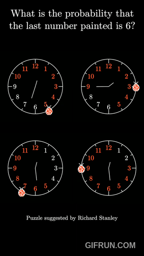

## Prompt
Solve the ladybug clock puzzle, YouTube video explanation [here](https://www.youtube.com/shorts/t3jZ2xGOvYg).  

A ladybug lands on the 12 of a clock, and every second she moves randomly to a neighboring number, either one step clockwise or one step counterclockwise.  
As soon as she lands on a number we mark that number as visited, continuing until every number has been visited.  

What is the probability that the very last number to get visited is the number 6?

&nbsp;
## Simulated Solution
Before solving mathematically, I wanted to see what the approximate solution would be using repeated simulation, as well as to see a nice illustration of the Central Limit Theorem at work.  
According to my rounds of simulation, the solution is something very close to 0.091.  

For the simulations which I have ran, one limiting factor is the number of rounds used to obtain single-sample probability estimates. When only using 100 rounds to product a probability estimate we are inherently limiting the precision of individual estimates to just two decimal places. When considering them together (for the mean or median) we can technically end up with an estimate with an additional degree of precision, but it's still limited.  
The same is true for the data I generated using 1000-round estimates, we get a maximum of three decimal places of precision in our estimate. 

&nbsp;
## Precise Solution
Before coming up with the deterministic solution, I'm hypothesizing that the answer will be 1/11 = 0.090909... where each position excluding 12 (since it's the starting point and therefore cannot be the answer) is equally likely.

Intuition would initially seem to suggest that 6 is the least probable outcome since it's the furthest from the starting point of 12 in terms of shortest path. But this dismisses the fact that each move clockwise or counterclockwise is random.
